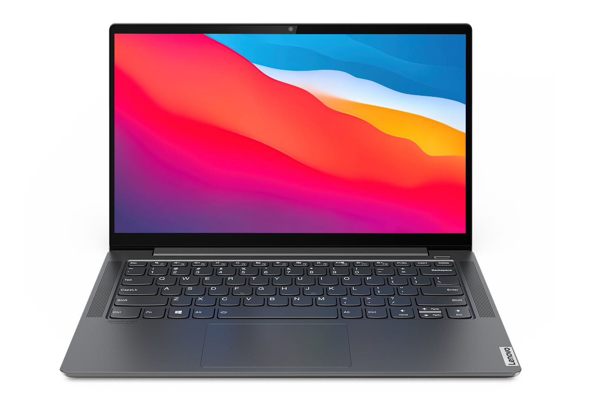

<h1 align="center">YOGA_S740-14IIL_i5-1035G1_OpenCore</h1>

## Specifications / 基本规格

| Specifications | Details |
|:---|:---|
| Model | Lenovo Yoga (Ideapad) S740-14IIL  (Lenovo 81RS / 81RM / 81RT)  |
| CPU | Intel Core i5-1035G1 / i5-1035G4 / i7-1065G7 (IceLake-U)|
| Memory | LPDDR4x 3733 MHz 16 GB |
| SSD | PHISON ECFM13.3 1024GiB |
| Integrated Graphics | Intel IceLake UHD Graphics 32EU / Iris Plus G4 48EU / Iris Plus G7 64EU |
| Wireless Card | dw1820a |
| BIOS | BYCN38WW / BYCN39WW |
|macOS Version| MacOS Ventora 13beta2</br>Further changes are needed if you want macOS 12</br>如果需要使用macOS 12，需要一些修改|

To `i7-1065G7` variant, you can also see: [frozenzero123/YOGA-S740](https://github.com/frozenzero123/YOGA-S740)
如果你在使用`i7-1065G7`版本，可以考虑使用[frozenzero123/YOGA-S740](https://github.com/frozenzero123/YOGA-S740)。本仓库基于此仓库内容精简修改而来。</br>
注：</br>
本项目是Zero-zer0的，由于Zero-zer0不再维护，而本人还在持续使用S740，opencore和驱动不断更新，本人做一些维护，也当个人备份。


## Current Issues / 目前存在的问题

### NOT Working / 不工作

| Feature | Status  | Remarks |
| --- | --- | --- |
| IR Sensor </br>红外人脸识别传感器 | ❌ |   macOS does not support such sensor.</br>macOS不支持这一类传感器|
| Intel SST Microphone Arrays</br>英特尔智音技术麦克风阵列 | ❌ |  Intel SST is not supported by AppleALC due to brand-new structure. </br>AppleALC 不支持 Intel 智音技术驱动的麦克风阵列 |
| dGPU | ❌ | Nvidia, xxxx xxx! |

### Working with Issues/ 工作但存在问题

| Feature | Status  | Remarks |
| --- | --- | --- | 
| Sleep </br>睡眠| ？ |   Yoga S740 only support `S0 modern standby` or `AOAC`(Always-On & Always-Connected), traditional `S3` is unsupported. The 'sleep' process cost 3-4% of battery pre hour， which consumes more power compared to the laptop supports `S3`. </br>由于Yoga S740只采用`S0现代待机`，又称`AOAC`（全时在线）技术， 并不支持传统的`S3`睡眠。这一睡眠会在每小时消耗3-4%的电池电量，明显高于支持`S3`睡眠的笔记本。|
|Touchpad</br>触摸板|  ✅ （GPIO/Polling </br> based on your choice）|`APIC Pin=0x30`(IRQ 48). Touchpad uses APIC interrupt under Windows and Linux and no implementation for GPIO interrupt is presented in ACPI.</br> Works with GPIO interrupt when enabling `Force unlock on all GPIO pads` in `PchSetup` with modifications on `_DSM` and `_CRS`. However, this brakes lid wake.</br> 
|Auto display after wake</br>开盖后自动亮屏| ? |Works **without modifying BIOS** </br> If GPIO interrupt is enabled, this won't work and you have to wake the laptop with power button. </br> 仅在不修改BIOS情况下可用</br>如果在BIOS中强制解锁GPIO中断，会导致开盖解锁失效，只能手动使用电源键唤醒。|


### Untested / 尚未测试
| Feature | Status  | Remarks |
| --- | --- | --- | 
|Thunderbolt 3</br>雷电3接口|Maybe|Most IceLake laptops' Thunderbolt port works out of box, even under macOS.</br>大多数Icelake笔记本的雷电3接口即使是在macOS下是免驱动的。|


## What's Working
### Power Management / 电源管理
| Feature | Status  | Remarks |
| --- | --- | --- | 
|CPU Power Management</br>CPU电源管理| ✅ |SMBIOS:`MacbookPro16,2`/ `MacbookAir9,1`</br>CPU frequency reaches 800MHz under no load conditions.</br>CPU在空载下默认可达到800MHz|
|Battery Status </br>电池电量显示|✅ |`SMCBatteryManager`+`ECEnabler.kext`
|iGPU Acceleration</br>核显加速|✅ | `AAPL,ig-platform-id`: `0x8A510002`</br>`device-id`:`0x8A51`|
|Power Profile Control</br>性能模式设置|✅ |Thanks to [YogaSMC](https://github.com/zhen-zen/YogaSMC), `YogaSMCNC` and related control panel is required)</br>归功于[YogaSMC](https://github.com/zhen-zen/YogaSMC)，需要额外安装`YogaSMCNC`与对应的设置面板|


### Display / 显示
| Feature | Status  | Remarks |
| --- | --- | --- | 
|Brightness Keys</br>亮度背光快捷键| ✅ |`BrightnessKeys.kext`|
|HiDPI|✅ |Recommend `1600x900` as HiDPI resolution.</br>推荐使用`1600x900`的HiDPI分辨率|

### IO / 输入输出
| Feature | Status  | Remarks |
| --- | --- | --- |
|AX201 WLAN|✅|`AirportItlwm.kext`, support `802.11ax`(WiFi6), much faster than Broadcom Wireless Cards|
|AX201 BT|✅|`IntelBluetoothFirmware.kext` + `IntelBluetoothInjector.kext`|
|Speakers/Headphone Combo Jack </br>扬声器与3.5毫米耳机接口 | ✅|`AppleALC.kext`, ALC285, `layout-id`=`88`  |
|Camera</br>摄像头|✅|USB UVC camera|


## Requirements / 需求和依赖
### BIOS settings / BIOS设置
* `Secure Boot`: OFF
* `DVMT Pre-allocate`: 64M or higher
* `CFG Lock`: OFF
* `Force unlock for all GPIO pads`: If you want the touchpad works at `GPIO` interrupt with some flaws.


Tools and location of registers, you may need `UEFITools` and `H20UVE`/ `ru.efi` to find/change by yourself.
解锁BIOS隐藏项目需要使用`UEFITools`查找相应设置的偏移量，并使用`H20UVE`或者`ru.efi`进行修改。

### Hardware / 硬件
* If your SSD is SAMSUNG PM981/PM981a, please replace it with a supported NVMe drive.
  如果你的SSD是三星PM981/PM981a，请换一个支持的NVMe硬碟。
* If your need AirDrop and more Broadcom wireless card based functions, replace AX201 and replace it with supported hardware.
  如果你需要如AirDrop一类依赖博通网卡的功能，请自行更换支持的博通网卡。

## How to build EFI / 如何编译本 EFI

This repo DOES NOT provide any built EFI. Please find a device running macOS with STRONG internet connection to build.

本仓库**不提供**编译好的EFI。请使用运行macOS的设备，在确保有**足够强**的网络条件下进行编译（比如说，能够正常下载GitHub中的内容）。

Use following command to build the EFI.

使用下述指令编译 EFI：

```bash
git clone https://github.com/Zero-zer0/YOGA_S740-14IIL_i5-1035G1_OpenCore
cd YOGA_S740-14IIL_i5-1035G1_OpenCore
chmod +x **/*.sh
./build.sh
```

Generated EFI will be put under `Output` folder if scripts succeed to fetch required files. Fill in your own SMBIOS (Follow [the guide](https://dortania.github.io/OpenCore-Post-Install/universal/iservices.html), with model `MacBookPro16,2` or `MacbookAir9,1`) and finish your `config.plist`.

你可以在 `Output` 目录下找到生成的 EFI。你需要自行生成 SMBIOS 信息（遵循 [这篇教程](https://dortania.github.io/OpenCore-Post-Install/universal/iservices.html 的步骤)，使用机型 `MacBookPro16,2`或`MacbookAir9,1`）并填入 `config.plist`中。

An example of files under `OC` folder:


```bash
.
├── ACPI
│   ├── ECDT.aml
│   ├── SSDT-EC.aml
│   ├── SSDT-GPRW.aml
│   ├── SSDT-NameS3-disable.aml
│   ├── SSDT-PROP.aml
│   ├── SSDT-RHUB-Reset.aml
│   └── SSDT-TPD0-GPIO-yoga_s740.aml
├── Drivers
│   ├── HfsPlus.efi
│   ├── OpenCanopy.efi
│   └── OpenRuntime.efi
├── Kexts
│   ├── ACPIBatteryManager.kext
│   ├── AirportItlwm.kext
│   ├── AppleALC.kext
│   ├── BrightnessKeys.kext
│   ├── ECEnabler.kext
│   ├── IntelBluetoothFirmware.kext
│   ├── IntelBluetoothInjector.kext
│   ├── Lilu.kext
│   ├── RestrictEvents.kext
│   ├── SMCProcessor.kext
│   ├── ThermalSolution.kext
│   ├── USBMap.kext
│   ├── VirtualSMC.kext
│   ├── VoodooI2C.kext
│   ├── VoodooI2CHID.kext
│   ├── VoodooPS2Controller.kext
│   ├── WhateverGreen.kext
│   └── YogaSMC.kext
├── OpenCore.efi
├── Resources
└── config.plist
```

## Credits

- [Acidanthera](https://github.com/acidanthera) : [AppleALC](https://github.com/acidanthera/AppleALC), [Lilu](https://github.com/acidanthera/Lilu), [OpenCore](https://github.com/acidanthera/OpenCorePkg), [VoodooPS2](https://github.com/acidanthera/VoodooPS2), [VirtualSMC](https://github.com/acidanthera/VirtualSMC), [WhateverGreen](https://github.com/acidanthera/WhateverGreen) ...

- [Apple](https://www.apple.com) for macOS.
  
- [frozenzero123](https://github.com/frozenzero123): [YOGA-S740](https://github.com/frozenzero123/YOGA-S740)

- [OC-little](https://github.com/daliansky/OC-little) : ACPI guides for OpenCore.

- [OpenIntelWireless](https://github.com/OpenIntelWireless): [itlwm](https://github.com/OpenIntelWireless/itlwm) and [IntelBluetoothFirmware](https://github.com/OpenIntelWireless/IntelBluetoothFirmware)

- [RehabMan](https://github.com/RehabMan): [OS-X-ACPI-Battery-Driver](https://github.com/RehabMan/OS-X-ACPI-Battery-Driver)

- [Steve Zheng](https://github.com/stevezhengshiqi) : Building scripts from [XiaoMi-Pro-Hackintosh](https://github.com/daliansky/XiaoMi-Pro-Hackintosh)

- [Sukka](https://github.com/Sukkaw): Doc sample and scripts

- [VoodooI2C Developer Team](https://github.com/VoodooI2C):  [VoodooI2C](https://github.com/VoodooI2C/VoodooI2C)

- [Zhen-zen](https://github.com/zhen-zen) : [YogaSMC](https://github.com/zhen-zen/YogaSMC) and [ThermalSolution](https://github.com/zhen-zen/ThermalSolution)

- [1Revenger1](https://github.com/1Revenger1/): [ECEnabler](https://github.com/1Revenger1/ECEnabler)

